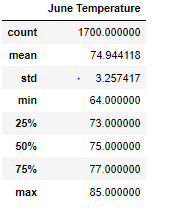
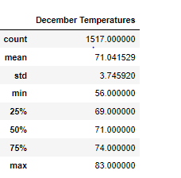
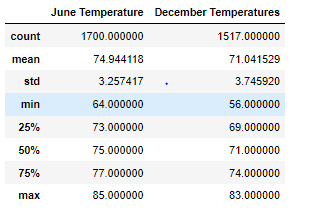

## **Overview of the analysis:** 

 
W. Avy wants to invest in a surf shop in Oahu, and for that purpose requires a statistical analysis of precipitation and temperature and precipitation in Oaha for the months of June and December in Oahu. We derive this information for W. Avy using data collected from the Weather stations and stored in the Measurement database. Since the data is small and focused, we chose to use the SQLITE Database as the data store. Python scripting was used to derive the analysis.


## **Results:** 

Fig 1.0 below displays the temperature statistics gathered from the weather stati for  June and December.

** The samples collected are different for both (1700 v/s 1517), which does not provide for a perfect comparison, but nonetheless,  is noteworthy.

| June  Temperature                                            | December Temperature                                         | Both months analysis                                         |
| ------------------------------------------------------------ | ------------------------------------------------------------ | ------------------------------------------------------------ |
|  |  |  |

**Fig 1.0**

From Fig 1.0 above:

1. The average temperature in June was about 75 degrees, with a highest of 85 degrees and a lowest of 64 degrees.
2. The average temperature in December was about 71 degrees, with a high of 83 degrees and a low of 56 degrees.
3. The temperature figures for both months had a standard deviations of 3.26 degrees in June and 3.75 degrees in December.

## Summary

From the temperature analysis above, Oahu is an excellent place to open up a surf and shake shack. The mild and warm year round averaging around  75 degrees in Summer and about 71 degrees well into Winter  implies that locals and tourists will be at the beaches surfing and relaxing year-round, providing a steady customer base for our business.

Excessive rain can prevent people from heading out to the beach. I have executed queries for the months of June and December that provide the number of intervals of time with no precipitation.

**Two additional queries to obtain the intervals of time when precipitation is ZERO.**

##### Query 1

results_precip_June = session.query(Measurement).filter(extract('month', Measurement.date) == 6).filter(Measurement.prcp==0).count()

##### Query 2

results_precip_Dec = session.query(Measurement).filter(extract('month', Measurement.date) == 12).filter(Measurement.prcp==0).count()

*** W. Abvy had previously requested a analysis of the precipitation in the area for the same months. We collected these analysis using Queries lsited above. 

```
No rain frequency in June 647
```

```
No rain frequency in December 510
```

**Note**:

The data from a specific weather station can be used dependent on which Weather station is applicable to the shop. In that case both the queries above would be augmented with the measurement station to look like: 

results_precip_Dec = session.query(Measurement).filter(extract('month', Measurement.date) == 12).filter(Measurement.prcp==0).filter(Measurement.station == "USC00519281") .count()
